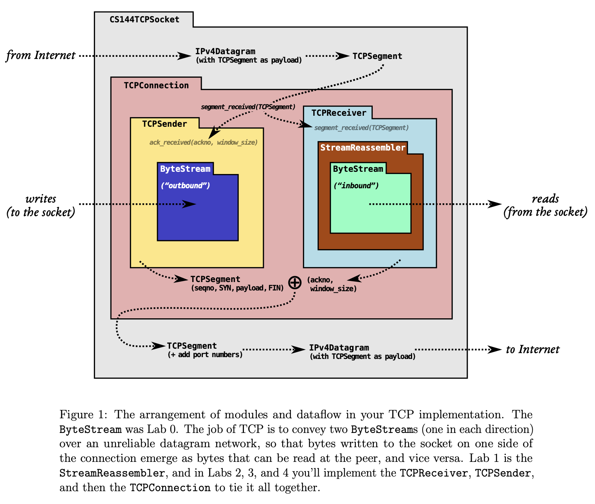
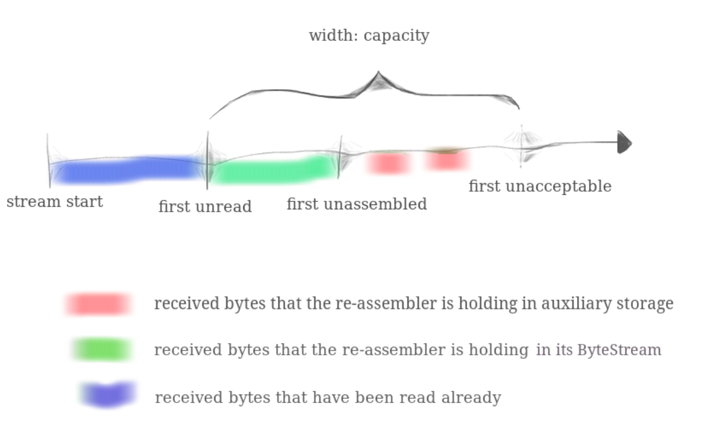
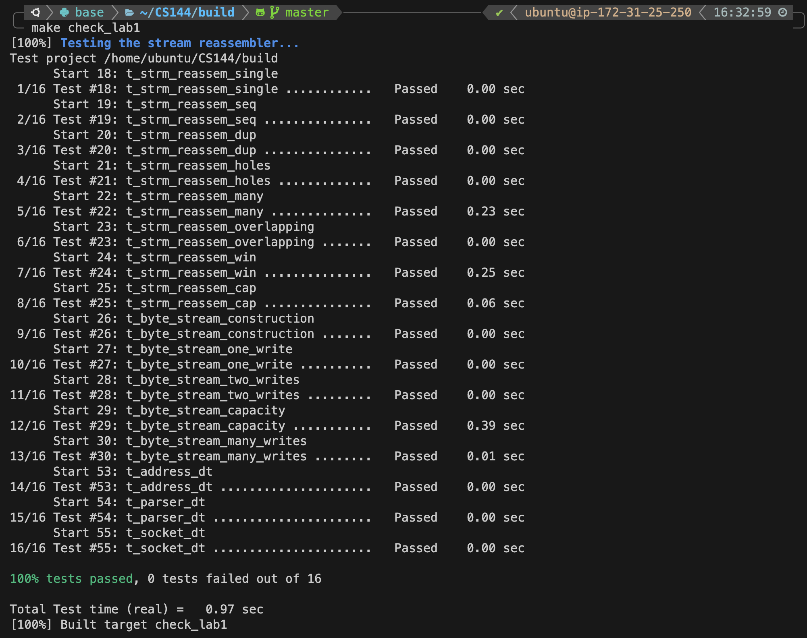

# Stanford CS 144, Lab 1: stitching substrings into a byte stream

- [x] Finish Stanford CS144 lab1 and pass the test. 2023/08/22 - 23:15

[toc]

## Task

The lab assignments will ask you to build up a TCP implementation in a modular way. Remember the `ByteStream` you just implemented in Lab 0? In the next four labs, you’ll end up convey two of them across the network: an “outbound” `ByteStream`, for data that a local application writes to a socket and that your TCP will send to the peer, and an “inbound” `ByteStream` for data coming from the peer that will be read by a local application. Figure 1 shows how the pieces fit together.

 

- In Lab 1, you’ll implement a *stream reassembler*—a module that stitches small pieces of the byte stream (known as substrings, or **segments**) back into a contiguous stream of bytes in the correct sequence.

Lab1 的任务是：实现一个流重组（*stream reassembler*）模块，该模块将字节流的小片段（称为子串或段）重新组合成连续的、正确序列的字节流。

我们将编写负责这种重新组装的数据结构：一个`StreamReassembler`。它会接收子串，由字节串和该字节串在**较大流**（这里的 lager stream 是什么意思）中的第一个字节的索引组成。流的每一个字节都有自己独特的索引，从零开始递增。`StreamReassembler`将拥有一个用于输出的`ByteStream`：只要 reassembler 知道了流的下一个字节，它就会将其写入`ByteStream`。所有者随时可以访问和读取`ByteStream`。

## Preprocess

由于最近的 CS144 换了新的 Github Repo，从原来的 sponge 换成了 minnow。我配置环境发现了一堆问题，所以我在网上找到了某个确定的版本（2021Fall），以下是参考链接：

- [所使用的 Sponge 版本](https://github.com/gene1974/sponge)
- [使用的 Lab 参考 PDF](https://github.com/Kiprey/sponge)

## Work

Lab 给出的模板代码如下，我们主要任务是合理的实现 `push_substring` 这样一个函数。

```cpp
// Construct a `StreamReassembler` that will store up to `capacity` bytes.
StreamReassembler(const size_t capacity);

// Receive a substring and write any newly contiguous bytes into the stream,
// while staying within the memory limits of the `capacity`. Bytes that would
// exceed the capacity are silently discarded.
//
// `data`: the substring
// `index` indicates the index (place in sequence) of the first byte in `data`
// `eof`: the last byte of this substring will be the last byte in the entire stream
void push_substring(const string &data, const uint64_t index, const bool eof);

// Access the reassembled ByteStream (your code from Lab 0)
ByteStream &stream_out();

// The number of bytes in the substrings stored but not yet reassembled
size_t unassembled_bytes() const;

// Is the internal state empty (other than the output stream)?
bool empty() const;
```

首先我们的重点是理解 `capacity` ，最开始我就是因为理解错 `capacity` 导致全部写错了。Official PDF 中给出了一个非常好理解的图：


我们会发现 `capacity` 限制了：**`ByteStream` 中的未读区字节和 `StreamReassembler` 中的未重新组装的字节总量。**  所以，我们在后续初始化和实现 `push_substring` 逻辑时要注意这个细节。

讨论如何实现 `push_substring` 的前提是理解 `StreamReassembler` 的逻辑。参考 FAQ 中的：“**什么时候应该将字节写入流？答：尽快。字节不应该在流中的唯一情况是，它前面的字节还没有被 `push` 时。**” 可以理解为，在一个 `bufffer` 中，我们维护一个需要被 `push` 的索引 `_cur_index`，我们会线性的 `push` `buffer` 中的字节，直到遇到一个  `buffer` 中没被写入的位置，这时候我们终止 `push` 直到当前 `_cur_index` 被写入。TODO [此处需要一个图]。

所以，我们需要同时维护 `buffer` 中每个字节的两个信息，分别是：`buffer` 中某位置具体元素的信息以及该位置是否真正被写入。而为了整个实现的方便，我选用 `std::vector< std::pair<char, bool> >` 作为整个 `StreamReassembler` 的核心数据结构，用 `pair` 中的第一个元素代表 `buffer` 中的元素，`pair` 中的第二个元素代表该位置是否真的被写入。

整个 `push_substring` 分为几个步骤：

- 首先，依据 `data`， `index` 和 维护的  `_eof_index` 计算出 `data` 可以写入的区间 `[start, end]` 并更新 `_eof_idnex`。**我之前就是在此处犯错误**，当我们 `push` 一个 `string` 且 `eof=1` 时，由于 `StreamReassembler` 的性质，我们**并不一定要立刻中断输入**，而是尝试更新 `_eof_index` 的信息，如果最后在 `push` 时遇上了 `_eof_index` 则结束输入。
- 执行写操作，把 `data` 中的数据写入 `buffer` 中并同时更新对应位置代表是否写入的布尔值，同时还需要维护一个 `unassemble_bytes_count` 用于后续两个函数。
- 执行写入 `ByteStream` 的操作，直到遇到 `_eof_index` 或者当前 `buffer` 位置并没有写入元素。
- 最后如果 `_cur_index` 遇到 `_eof_index` 则代表这边不会再输入，因此执行 `ByteStream.end_input()`

下面给出最终的代码，首先给出 `stream_reassembler.hh` 

```cpp
//! \brief A class that assembles a series of excerpts from a byte stream (possibly out of order,
//! possibly overlapping) into an in-order byte stream.
class StreamReassembler {
  private:
    // Your code here -- add private members as necessary.

    ByteStream _output;               //!< The reassembled in-order byte stream
    size_t _capacity;                 //!< The maximum number of bytes
    size_t _cur_index;                //!< The current index of the buffer
    size_t _eof_index;                //!< The index of the last byte of the entire stream
    size_t _unassembled_bytes_count;  //!< The number of bytes in the substrings stored but not yet reassembled
    //!< The data buffer, with a flag indicating whether the byte has been pushed
    std::vector<std::pair<char, bool>> _buffer;

  public:
    //! \brief Construct a `StreamReassembler` that will store up to `capacity` bytes.
    //! \note This capacity limits both the bytes that have been reassembled,
    //! and those that have not yet been reassembled.
    StreamReassembler(const size_t capacity);

    //! \brief Receive a substring and write any newly contiguous bytes into the stream.
    //!
    //! The StreamReassembler will stay within the memory limits of the `capacity`.
    //! Bytes that would exceed the capacity are silently discarded.
    //!
    //! \param data the substring
    //! \param index indicates the index (place in sequence) of the first byte in `data`
    //! \param eof the last byte of `data` will be the last byte in the entire stream
    void push_substring(const std::string &data, const uint64_t index, const bool eof);

    //! \name Access the reassembled byte stream
    //!@{
    const ByteStream &stream_out() const { return _output; }
    ByteStream &stream_out() { return _output; }
    //!@}

    //! The number of bytes in the substrings stored but not yet reassembled
    //!
    //! \note If the byte at a particular index has been pushed more than once, it
    //! should only be counted once for the purpose of this function.
    size_t unassembled_bytes() const;

    //! \brief Is the internal state empty (other than the output stream)?
    //! \returns `true` if no substrings are waiting to be assembled
    bool empty() const;
};

```

随后给出 `stream_reassembler.cc`

```cpp
StreamReassembler::StreamReassembler(const size_t capacity)
    : _output(capacity)
    , _capacity(capacity)
    , _cur_index(0)
    , _eof_index(std::numeric_limits<size_t>::max())
    , _unassembled_bytes_count(0)
    , _buffer(std::vector<std::pair<char, bool>>(capacity, std::make_pair('$', false))) {}

//! \details This function accepts a substring (aka a segment) of bytes,
//! possibly out-of-order, from the logical stream, and assembles any newly
//! contiguous substrings and writes them into the output stream in order.
void StreamReassembler::push_substring(const string &data, const size_t index, const bool eof) {
    const size_t length = data.length();

    size_t begin = std::max(index, _cur_index);
    size_t end = std::min(index + length, std::min(_eof_index, _cur_index + _capacity - _output.buffer_size()));
    // If eof is true, update the eof_index.
    if (eof) {
        //! We can't use end, since end may be smaller than
        //! index + length (when the output byteStream is full).
        _eof_index = std::min(_eof_index, index + length);
    }

    // Assgin the data to the buffer.
    for (size_t i = begin, j = begin - index; i < end; ++i, ++j) {
        // i: the index of the buffer.
        // j: the index of the data.
        if (!_buffer[i % _capacity].second) {
            _buffer[i % _capacity] = std::make_pair(data[j], true);
            // Write a byte to the reassembled stream.
            ++_unassembled_bytes_count;
        } else {
            assert(_buffer[i % _capacity].first == data[j] && "The data is not the same.");
        }
    }

    // Write the data to the output stream.
    std::string write_data = "";
    while (_cur_index < _eof_index && _buffer[_cur_index % _capacity].second) {
        write_data.push_back(_buffer[_cur_index % _capacity].first);
        _buffer[_cur_index % _capacity].second = false;
        ++_cur_index;
        --_unassembled_bytes_count;
    }

    if (!write_data.empty()) {
        _output.write(write_data);
    }

    // Check if the input is ended.
    if (_cur_index == _eof_index) {
        //! Note btyeStream.eof() <=> (input_ended() && buffer.empty())
        _output.end_input();
    }
}

size_t StreamReassembler::unassembled_bytes() const { return _unassembled_bytes_count; }

bool StreamReassembler::empty() const { return unassembled_bytes() == 0; }
```

最后 `Test` 结果如下：



时间复杂度感觉略高了，但是目前也没想到很好的优化途径。
