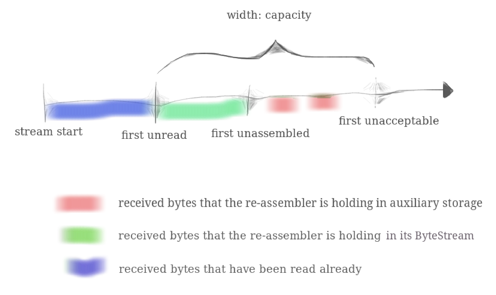
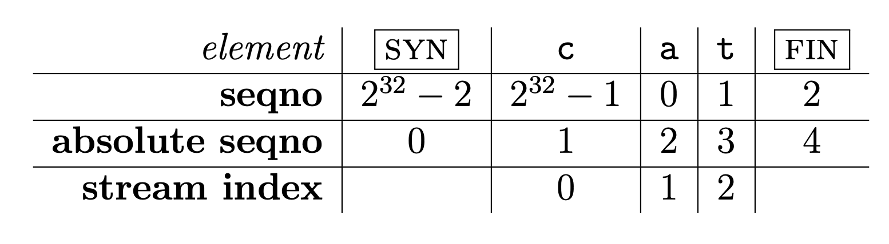
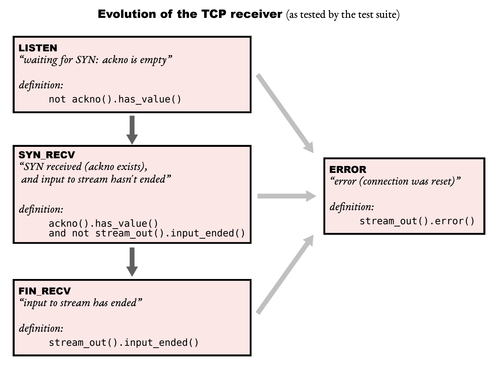
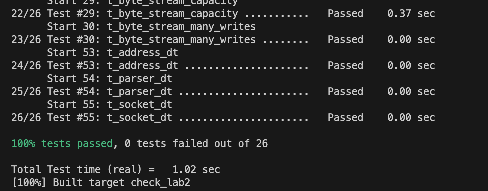

# Stanford CS144, Lab2: The  `TCPReciver`

- [x] Finish Stanford CS144 Lab2 and pass the test. 2023/10/11 - 18:50

[toc]

## Task

在Lab0和Lab1中，我们分别实现了 ByteStream 和 Stream Reassembler，在 Lab2 中我们需要实现的是 TCPReceiver，用以接收传入的 TCP Segment 并将其转换成用户可读的数据流。

> In addition to writing to the incoming stream, the `TCPReceiver` is responsible for telling the sender two things: 
>
> 1. The index of the “first unassembled” byte, which is called the “acknowledgment number” or `ackno`. This is the first byte that the receiver needs from the sender.  (In TCP, acknowledgment means, “What’s the index of **the next byte that the receiver needs** so it can reassemble more of the ByteStream?” This tells the sender what bytes it needs to send or resend.)
> 2. The distance between the “first unassembled” index and the “first unacceptable” index. This is called the `window size`.

`ackno` 和 `window size` 共同描述了接收者当前的**接收窗口**。接收窗口是 发送者允许发送数据的一个范围，通常 TCP 接收方使用接收窗口来进行**流量控制**，限制发送方发送数据。更具体的来说，`ackno` 可以看作接收窗口的左边界，`ackno + window size` 为接收窗口的右边界。

> **My Question: How to realize the concept of `acknowledge sequence number`?**
>
> “确认序列号”（Acknowledgment Sequence Number，通常简称为“ack”）是TCP（传输控制协议）中一个核心概念，它指示了发送方最后一个被接收方成功接收和确认的字节的序列号，以及接收方期望的下一个字节的序列号。
>
> ### 定义：
>
> 在TCP连接中，当接收方从发送方接收到一个数据段后，它需要向发送方发送一个确认，表示它已经接收到了这些数据。这个确认包含一个“确认序列号”，它告诉发送方，到目前为止，所有的数据都已经被成功接收，并且接收方现在期望接收哪个序列号的字节。
>
> ### 为什么需要和有什么用：
>
> 1. **数据的可靠传输**：TCP是一个可靠的协议，它需要确保所有发送的数据都准确无误地到达接收方。通过使用确认序列号，接收方可以告诉发送方它已经收到了哪些数据，如果有任何数据丢失或损坏，发送方可以重新发送那些数据。
>
> 2. **流量控制**：确认序列号允许接收方控制发送方的数据发送速率，避免因缓冲区溢出而导致的数据丢失。
>
> 3. **拥塞控制**：通过观察确认的返回速率，发送方可以估计网络的拥塞程度，并相应地调整其数据发送速率。
>
> ### 如何实现：
>
> 1. **发送ACK**：当接收方收到一个数据段时，它计算出下一个期望的字节的序列号。如果接收到的数据没有问题，这个序列号通常是接收到的TCP段中最后一个字节的序列号加1。接收方然后创建一个新的TCP段，其中包含这个确认序列号，发送回发送方。
>
> 2. **处理丢失的数据**：如果接收方检测到数据段中有缺失的或损坏的数据（例如，因为它收到了一个跳跃的序列号），它可以重新发送最后一个确认序列号，提示发送方重新发送丢失的数据。
>
> 3. **延迟确认**：为了减少网络上的通信量，接收方可能不会立即对每个接收到的数据段发送确认。它可能会等待短暂的时间或直到它有数据发送回发送方时才发送确认。
>
> ### 例子：
>
> 假设A（发送方）和B（接收方）正在进行TCP通信。
>
> 1. A发送一个数据段，其中包含字节序列号101到200。
> 2. B接收数据段，并检查序列号，确认收到字节101到200。
> 3. B发送一个确认回A，确认号设置为201，表示B现在期望接收字节序列号201（也就是说，字节101到200已经成功接收）。
> 4. A收到确认后知道B已成功接收字节101到200，并根据需要继续发送后续数据。
>
> 通过“确认序列号”，TCP确保了数据的可靠传输，即使在网络条件不佳的情况下也能正确传递信息。
>
> ---
>
> **My Question: How to realize the concecpt of `window_size`？**
>
> `Window Size` 是当前的 `capacity` 减去 `ByteStream` 中尚未被读取的数据大小，即 `reassembler` 可以存储的尚未装配的子串索引范围。可以参考 Lab1 中的经典图片：
>
> 
>
> 显然，绿色的是 ByteStream 已经处理的字节，也就是 `ByteStream.buffer_size()`。红色的是 `reassembler` 接收但是没有被处理的字节。**由于这一部分是可以被覆盖的**，所以 `Windows_size` 就等价于 `capacity - ByteStream.buffer_size()`。

## Translating between 64-bit indexes and 32-bit seqnos

作为热身，我们需要实现TCP的索引表示方法。之前，你创建了一个StreamReassembler，它可以重新组装子字符串，其中每个独立字节都有一个 64 位的流索引，流中的第一个字节的索引始终为零。64位的索引足够大，我们可以视其为永不溢出。然而，在TCP头部中，空间是宝贵的，流中的每个字节的索引不是用 64 位的索引来表示，而是用32位的“sequence number”或 “seqno” 来表示。这增加了三个复杂性：

- 首先，我们需要保证 `seqno` 可以循环使用，因为 32 位整数最后表达 4GB 的数据，这显然是不够的。
- TCP seqno 从一个随机值开始：为了提高安全性并避免由于早期在相同端点间的连接的旧段而产生混淆，TCP尝试确保序列号不容易被猜到并且不太可能重复。因此，流的序列号不是从零开始。流中的第一个序列号是一个称为初始序列号（ISN，Initial Sequence Number）的随机32位数。这个序列号代表了SYN（流的开始）。之后，其余的序列号正常运行：第一个数据字节将具有序列号 ISN+1（模 2^32），第二个字节将具有序列号 ISN+2（模 2^32），等等。这样设计的好处是增加安全性和避免混淆。在网络中，数据包可能会因为各种原因（如网络拥堵或路由器故障）而延迟。如果一个连接已经关闭，而它的数据包仍然在网络中，当新的连接建立时，这些延迟的数据包可能会到达接收方。如果新旧连接的序列号没有区别，接收方可能会错误地将旧数据包视为新连接的一部分。而随机的 ISN 可以有效的避免这个问题。
- 逻辑开始（SYN）和结束（FIN）各占用一个序列号：除了确保接收所有数据字节外，TCP 还确保数据流的开始和结束能够可靠地接收。因此，在TCP中，SYN（流开始）和 FIN（流结束）控制标志被分配了序列号。每个标志占用一个序列号。（SYN 标志占用的序列号是 ISN）流中的每个数据字节也占用一个序列号。请记住，SYN 和 FIN 并非流本身的一部分，它们不是“字节”——它们代表字节流本身的开始和结束。

> Q: 为什么 SYN 和 FIN 需要占一个序列号？
>
> 让我们通过一个简单的例子来解释为什么SYN需要占用一个序列号，以及如果它不占用序列号，可能会导致什么问题。
>
> 假设我们有两台计算机A和B，它们想通过TCP协议建立连接。在TCP协议中，每个连接都由一个四元组定义：源IP地址、源端口、目标IP地址和目标端口。同时，每台计算机都维护一个序列号，以追踪发送和接收的数据。
>
> ### 场景1: SYN占用序列号
>
> 1. A想要与B建立连接，所以它发送一个带有SYN标志的段到B，并为这个段分配一个序列号，比如序列号为100（这个序列号通常是随机生成的，我们这里用100来简化说明）。
> 2. B收到了这个SYN段，知道A的初始序列号是100，于是它可以准确地预期下一个序列号是101（因为SYN占用了一个序列号）。
> 3. A开始发送数据，第一个数据字节的序列号是101，这与B的预期相符，所以数据传输顺利进行。
>
> ### 场景2: SYN不占用序列号
>
> 1. A想要与B建立连接，它发送一个带有SYN标志的段到B，但这次SYN不占用序列号，序列号仍然是0。
> 2. B收到了这个SYN段，但它不知道A的初始序列号是什么，因为SYN没有占用序列号。它可能会默认下一个序列号是1。
> 3. A开始发送数据，它认为第一个数据字节的序列号应该是1（因为它认为SYN占用了一个序列号），但B预期第一个数据字节的序列号是0。这种不一致会导致B拒绝或丢弃接收到的数据，因为序列号不匹配，从而导致连接建立失败或数据传输错误。
>
> 从这个例子中，我们可以看到，SYN占用一个序列号可以确保连接双方在序列号的同步上保持一致，从而确保数据传输的准确性和可靠性。如果SYN不占用序列号，连接双方可能会在序列号的同步上产生不一致，导致数据传输错误或连接建立失败。

这些序列号（seqnos）在每个TCP段的头部传输。（同样，有两个流 —— 每个方向一个。每个流都有独立的序列号和不同的随机ISN。）有时，我们会讨论“**absolute sequence number**”的概念（始终从零开始，不回绕）以及“**stream index**”的概念（注意我们已经在 StreamReassembler 中使用了相关的概念：流中每个字节的索引，从零开始）也是有帮助的。

下面我们讲具体讲解三种不同索引的区别：

| Sequence Numbers         | Absolute Sequence Numbers      | Stream Indices                 |
| ------------------------ | ------------------------------ | ------------------------------ |
| 从 ISN 开始              | 从 0 开始                      | 从 0 开始                      |
| 包括 SYN/FIN Flags       | 包括 SYN/FIN Flags             | 忽略 SYN/FIN Flags             |
| 32bits，wrapping（回绕） | 64bits, non-wrapping（不回绕） | 64bits, non-wrapping（不回绕） |
| Alias: `seqno`           | Alias: `absolute seqno`        | Alias: `stream index`          |



上图是一个具体的例子，用来展示实际例子中不同索引的情况。接下来我们具体考虑如何实现 `WrappingInt32` 的实现。

### `wrap`

针对第一个函数：`WrappingInt32 wrap(uint64_t n, WrappingInt32 isn)` ，实际上非常简单，考虑如下公式：
$$
\mathrm{seqno \equiv ISN + absolute\; seqno\; (\bmod 2^{32})}
$$
所以直接实现即可。

### `unwrap`

针对第二个函数：`uint64_t unwrap(WrappingInt32 n, WrappingInt32 isn, uint64_t checkpoint)` ，这一个函数相对难一些。

首先，我们需要搞清楚这个函数的目的是：**Convert seqno $\rightarrow$ absolute seqno**。其次我们需要知道每个参数的含义，其中 `n` 代表 `seqno` ，`isn` 代表 `ISN` 都很显而易见。但是，我最开始对`checkpoint` 的含义十分困惑？实际上 `checkpoint` 作用不难推断，是用来为 absolute seqno 寻找一个参考点，用于帮助确定序列号（seqno）如何映射到绝对序列号（absolute seqno）。但在实际调用过程中，我们应该传入具体的什么值呢？我们需要一个已经确定的 asbolute seqno 来进行参考，唯一可选的便是 `absolute acknowledge sequence number (abs_ackseqno)`。

我们先尝试用数学公式拆解这个函数的功能。
$$
\begin{array}{l}
\mathrm{n \equiv absolute\; seqno + ISN \; (\bmod 2^{32})} \\
\mathrm{absolute\; seqno \equiv n - ISN \; (\bmod 2^{32})} \\
\mathrm{absolute\; seqno = (n - ISN) \bmod2^{32} + k\times 2^{32}} | k \in \mathbb{Z}
\end{array}
$$
考虑到要最捷径 `checkpoint` 所以一定有，因为我们可以任意控制我们的 $k$ 使得 `absolute seqno` 在这个范围内。进一步观察，我们发现  `absolute seqno`  的低 32 bits 已经确定，而高 32 bits 我们只需要考虑 `checkpoints` **加减** $2^{32}$ 后的结果。
$$
\mathrm{checkpoint  - 2^{32} \le absolute\; seqno \le checkpoint + 2^{32}}
$$
最后我们给出 `WrappingInt32` 的实现代码：

```cpp
WrappingInt32 wrap(uint64_t n, WrappingInt32 isn) {
    return WrappingInt32(static_cast<uint32_t>(n + isn.raw_value()));
}

uint64_t unwrap(WrappingInt32 n, WrappingInt32 isn, uint64_t checkpoint) {
    // Since the low 32 bits don't influence the result, we can directly
    // calculate them.
    uint32_t low32bit = static_cast<uint32_t>(n - isn);
    uint64_t hight32bit_add1 = (checkpoint + (1 << 31)) & 0xFFFFFFFF00000000;
    uint64_t hight32bit_minus1 = (checkpoint - (1 << 31)) & 0xFFFFFFFF00000000;
    uint64_t absolute_add1 = hight32bit_add1 | low32bit;
    uint64_t absolute_minus1 = hight32bit_minus1 | low32bit;

    // Compare the distance between the checkpoint and the two possible
    // results.
    if (max(absolute_add1, checkpoint) - min(absolute_add1, checkpoint) <=
        max(absolute_minus1, checkpoint) - min(absolute_minus1, checkpoint)) {
        return absolute_add1;
    } else {
        return absolute_minus1;
    }
    return -1; // Error.
}
```

## `TCPReceiver` Implementation

## Environment Setup

在配置 Lab2 的环境时出现了一个小问题：

> In file included from /home/ubuntu/CS144/tests/tcp_parser.cc:4: /home/ubuntu/CS144/tests/test_utils.hh:10:10: fatal error: pcap/pcap.h: No such file or directory   10 | #include <pcap/pcap.h>      |          ^~~~~~~~~~~~~ compilation terminated. make[2]: *** [tests/CMakeFiles/tcp_parser.dir/build.make:76: tests/CMakeFiles/tcp_parser.dir/tcp_parser.cc.o] Error 1 make[1]: *** [CMakeFiles/Makefile2:5085: tests/CMakeFiles/tcp_parser.dir/all] Error 2 make: *** [Makefile:101: all] Error 2

实际上，遇到的错误信息指出，编译器在尝试编译 `tcp_parser.cc` 文件时无法找到 `pcap/pcap.h` 文件。`pcap/pcap.h` 是 libpcap 库的头文件，libpcap 是一个用于网络流量捕获的库。

要解决这个问题，你需要在你的系统上安装 libpcap 开发库。在 Ubuntu 系统上，你可以通过运行以下命令来安装 libpcap 开发库：

```bash
sudo apt-get update
sudo apt-get install libpcap-dev
```

## TCPReciver Implementation

首先，我们需要参考 Lab2 的 PDF 中给出的一个图，有助于我们理解 TCP Receiver 的工作和状态转移流程。



对于 `TCPReceiver` 来说，除了错误状态以外，它一共有 3 种状态，分别是：

- `LISTEN`：等待 SYN 包的到来。若在 SYN 包到来前就有其他数据到来，则**必须丢弃**。
- `SYN_RECV`：获取到了 SYN 包，此时可以正常的接收数据包
- `FIN_RECV`：获取到了 FIN 包，此时务必终止 `ByteStream` 数据流的输入。

在每次 `TCPReceiver` 接收到数据包时，我们该如何知道当前接收者处于什么状态呢？可以通过以下方式快速判断：

- 当 `ISN` 还没设置时，肯定是 `LISTEN` 状态
- 当 `ByteStream.input_ended()`，则肯定是 `FIN_RECV` 状态
- 其他情况下，是 `SYN_RECV` 状态

**实际实现过程中不需要区分 `FIN_RECV` 和 `SYN_RECV`，只管往 `reassember` 里塞字符片段即可，因为 `reassember` 足够鲁棒**，如果是 `FIN_RECV` 状态了，塞进去了自然会被丢弃。

`ackno` 的全称是 `acknowledge sequence number`，那么考虑到之前的解释，必须考虑到 SYN 和 FIN 标志，因为这两个标志各占一个 `seqno`。故在返回 `ackno` 时，务必判断当前接收者处于什么状态，然后依据当前状态来判断是否需要对当前的计算结果加 $1$ 或加 $2$ 。而这条准则对 `push_substring` 时同样适用（因为我们需要考虑到 `stream_index` 的维护）。

基于上面的套路内容，实现这个函数，首先我们要维护一个 `ISN`，这里我们使用 C++17 `std::optional` 来维护 `ISN`。下面是实现后的 `TCPReciever` 类：

```cpp
//! Receives and reassembles segments into a ByteStream, and computes
//! the acknowledgment number and window size to advertise back to the
//! remote TCPSender.
class TCPReceiver {
    //! Our data structure for re-assembling bytes.
    StreamReassembler _reassembler;

    //! The maximum number of bytes we'll store.
    size_t _capacity;

    // USe a std::optional to define the ISN.
    std::optional<WrappingInt32> _isn;

  public:
    //! \brief Construct a TCP receiver
    //!
    //! \param capacity the maximum number of bytes that the receiver will
    //!                 store in its buffers at any give time.
    TCPReceiver(const size_t capacity)
      : _reassembler(capacity)
      , _capacity(capacity)
      , _isn(std::nullopt) {}

    /* ... omit */
}
```

### `segment_received`

我来回答代码中两个比较容易引起困惑的点：

- 为什么 `abs_ackno` 需要加1？依据 `abs_ackno` 的定义，This is the first byte that the receiver needs from the sender. 而 `stream_out().bytes_written()` 代表的是已经写入的数据，但是 ACK 实际上指的是接收方希望收到的**下一个字节**的序号，因此，我们需要加一。
- 为什么计算 `stream_index` 时需要加上 `header.syn` 再减一 ？这里的原理是什么？这是因为我们默认维护的 `abs_seqno` 是考虑到 `SYN` 位的，而 `stream_index` 是考虑整个数据流的传输并不考虑 `SYN`。所以当 `SYN` 存在时，`abs_seqno` 的考虑是合理的，这时候我们不需要修改 `abs_seqno`。但是当 `SYN` 不存在时，`abs_seqno` 额外多考虑了一位，所以我们需要减去多余的一位。

```cpp
void TCPReceiver::segment_received(const TCPSegment &seg) {
    const auto &header = seg.header();
	
    // 如果 _isn 还没有初始化，说明在 LISTEN 模式。
    if (!_isn.has_value()) {
        // Drop before *LISTEN*.
        if (!header.syn) return void();
        // Set the Initial Seq Number.
        _isn = header.seqno;
    }

    // *SYN RECV*
    // Denote the first byte that the receiver needs from the sender.
    // 为什么 abs_ackno 需要加1？
    uint64_t abs_ackno = stream_out().bytes_written() + 1;
    // 这里 abs_ackno 是用来作为 abs_seqno 的参考值。
    uint64_t abs_seqno = unwrap(header.seqno, _isn.value(), abs_ackno);

    //! 为什么这里需要加上 header.syn 再 -1 ？这里的原理是什么？
    uint64_t stream_index = abs_seqno + header.syn - 1;

    // If header.fin is true, then state tranfer to *FIN_RECV*.
    // 这里没啥好说的，就正常的使用即可。
    _reassembler.push_substring(
        seg.payload().copy(), stream_index, header.fin);
}

```

### `ackno`

前面我们提及了 `ackno` 的定义：**the sequence number of the first byte that the receiver doesn’t already know**。既然说到了 `seqno` 所以我们一定要考虑 `SYN` 和 `FIN` 的影响。下面的实现参考了 `SYN` 和 `FIN` 的影响，结构也很简单。

```cpp
optional<WrappingInt32> TCPReceiver::ackno() const {
    // LISTEN
    if (!_isn.has_value()) return nullopt;
    // SYN_RECV
    WrappingInt32 ackno = wrap(stream_out().bytes_written() + 1, _isn.value());
    // FIN_RECV
    if (stream_out().input_ended()) ackno = ackno + 1;
    return ackno;
}
```

### `window_size`

这个最简单，把之前介绍的 `window_size` 的概念理解下就可以直接写出代码。

```cpp
size_t TCPReceiver::window_size() const {
    // Window size = capacity - buffer already received.
    return _capacity - stream_out().buffer_size();
}
```

## Test

✅ 轻松通过



